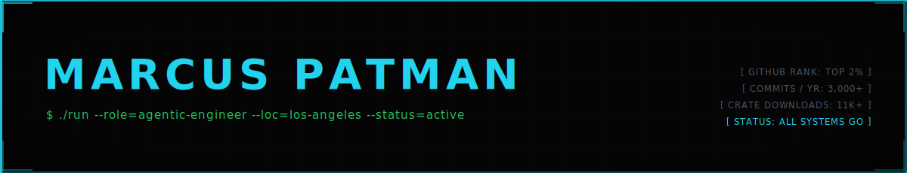

**Los Angeles, CA · Agentic Systems Engineer**

I build autonomous multi-agent systems that let one engineer ship like a team.

[-3%2C000%2B-2b2b2b?style=flat-square&logo=github&logoColor=white)](https://github.com/marcuspat)

`Autonomous Agent Orchestration` · `Multi-Agent Swarm Coordination` · `Cloud-Native Infrastructure` · `Rust Systems Tooling`

[Turbo-Flow Stack](#the-turbo-flow-stack) · [Developer Tooling](#developer-tooling) · [Rust Crates](#published-rust-crates) · [Organizations](#organizations)

---

## The Turbo-Flow Stack

| Tool | Stars | Lang | Purpose |
|---|---|---|---|
| [turbo-flow](https://github.com/marcuspat/turbo-flow) | ⭐ 162 | Shell / Python | Full agentic dev environment — 215+ MCP tools, cross-session memory (Beads), codebase knowledge graph (GitNexus), per-agent git-worktree isolation. One command bootstraps on DevPod, Codespaces, or Rackspace Spot. |

## Developer Tooling

| Tool | Stars | Lang | Purpose |
|---|---|---|---|
| [cargo-forge](https://github.com/marcuspat/cargo-forge) | ⭐ 16 | Rust | Interactive Rust project generator — 7 typed templates: CLI, API server, WebAssembly, game engine, embedded. |
| [secret-scan](https://github.com/adventurewave-labs/secret-scan) | ⭐ 9 | Rust | Blazing-fast secret scanner for codebases — AWS keys, GitHub tokens, API secrets. Published as `secretscan` on crates.io. |
| [codescope](https://github.com/adventurewave-labs/codescope) | — | Rust | Single-binary code intelligence engine for AI coding agents — tree-sitter, MCP, CLI. |
| [Sentinel](https://github.com/marcuspat/Sentinel) | — | Rust | Safe agentic sysadmin — file operations, process control, network inspection with human-in-the-loop guardrails. |
| [spacelift-intent](https://github.com/marcuspat/spacelift-intent) | — | Go | Natural language → cloud infrastructure via Terraform/OpenTofu APIs. |

---

## Published Rust Crates

8 crates on crates.io — 11,000+ total downloads.

### Networking & Observability

| Crate | Downloads | Purpose |
|---|---|---|
| [netrain](https://crates.io/crates/netrain) | 3,489 | Matrix-style network packet monitor with IP tracking and threat detection |
| [k8s-netinspect](https://crates.io/crates/k8s-netinspect) | 482 | Minimal Kubernetes network inspection — CNI and pod connectivity |
| [rustops](https://crates.io/crates/rustops) | 20 | Lightweight anomaly detection for operations metrics |

### Security & Cryptography

| Crate | Downloads | Purpose |
|---|---|---|
| [cargocrypt](https://crates.io/crates/cargocrypt) | 1,572 | Zero-config cryptographic operations for Rust projects |

### Utilities

| Crate | Downloads | Purpose |
|---|---|---|
| [file-hasher](https://crates.io/crates/file-hasher) | 468 | Fast SHA256 / SHA1 / MD5 file hashing CLI with progress output |
| [turbo-fnv](https://crates.io/crates/turbo-fnv) | 381 | Drop-in FNV hash replacement with batch-processing optimizations |

---

## Organizations

| Org | Focus |
|---|---|
| [adventurewave-labs](https://github.com/adventurewave-labs) | Open-source developer tooling for the Claude and agentic AI ecosystem — the lab behind turbo-flow |
| [creandotumatrix-labs](https://github.com/creandotumatrix-labs) | Agentic AI engineering and cloud-native solutions for Latin America |

---

`Rust` · `Python` · `Shell` · `Kubernetes` · `Terraform` · `ArgoCD` · `AWS` · `GCP` · `Azure` · `Claude Code` · `SPARC`

📧 marcus@adventureonthewave.com · [LinkedIn](https://linkedin.com/in/marcuspatman) · [marcuspatman.space](https://marcuspatman.space) · [X @marcuspat](https://x.com/marcuspat)
