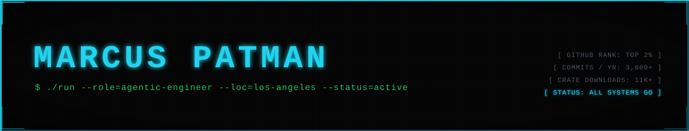

**Los Angeles, CA · Agentic Systems Engineer**

I build autonomous multi-agent systems that let one engineer ship like a team.

[-3.6K%2B-2b2b2b?style=flat-square&logo=github&logoColor=white)](https://github.com/marcuspat)

`Autonomous Agent Orchestration` · `Multi-Agent Swarm Coordination` · `Cloud-Native Infrastructure` · `Rust Systems Tooling`

[Turbo-Flow Stack](#the-turbo-flow-stack) · [Developer Tooling](#developer-tooling) · [Rust Crates](#published-rust-crates) · [Organizations](#organizations)

---

## The Turbo-Flow Stack

| Tool | Stars | Lang | Purpose |
|---|---|---|---|
| [turbo-flow](https://github.com/marcuspat/turbo-flow) | ⭐ 168 | Shell / Python | Full agentic dev environment — 215+ MCP tools, cross-session memory (Beads), codebase knowledge graph (GitNexus), per-agent git-worktree isolation. One command bootstraps on DevPod, Codespaces, or Rackspace Spot. |
| [turbo-flow-wizard](https://github.com/adventurewave-labs/turbo-flow-wizard) | ⭐ 5 | Shell | Guided setup wizard for turbo-flow — interactive generator for project-specific CLAUDE.md configs. 12 app types, 7 methodologies, 19 feature sets. |
| [cloop](https://github.com/adventurewave-labs/cloop) | ⭐ 0 | Rust | Agentic loops for Claude Code — zero-dependency CLI that wraps `claude --print` in a configurable loop until tests pass, a marker appears, or N iterations. |

### In motion

|  |  |
|:---:|:---:|
| *turbo-flow — real install, real tmux workspace, real claude launch* | *turbo-flow-wizard — interactive CLAUDE.md generator* |

|  |
|:---:|
| *cloop — agentic loops for Claude Code: new → list → show* |

## Developer Tooling

| Tool | Stars | Lang | Purpose |
|---|---|---|---|
| [cargo-forge](https://github.com/marcuspat/cargo-forge) | ⭐ 16 | Rust | Interactive Rust project generator — 7 typed templates: CLI, API server, WebAssembly, game engine, embedded. |
| [netrain](https://github.com/marcuspat/netrain) | ⭐ 2 | Rust | Matrix-style network packet monitor — real-time DDoS and port-scan detection in the terminal. |
| [Sentinel](https://github.com/marcuspat/Sentinel) | — | Rust | Safe agentic sysadmin — file operations, process control, network inspection with human-in-the-loop guardrails. |
| [spacelift-intent](https://github.com/marcuspat/spacelift-intent) | — | Go | Natural language → cloud infrastructure via Terraform/OpenTofu APIs. |

### In motion

*netrain — live packet monitor with threat detection*

|  |  |  |
|:---:|:---:|:---:|
| *Sentinel — safe agentic sysadmin* | *cargo-forge — interactive Rust project generator* | *spacelift-intent — natural language → cloud infrastructure* |

More tooling — `secret-scan`, `codescope`, and the rest of the lab — lives at [adventurewave-labs](https://github.com/adventurewave-labs).

---

### Lab / Demos

Experiments, proofs of concept, and agentic demos.

| Repo | What it explores |
|---|---|
| [agentic-powered-golden-path-demo](https://github.com/adventurewave-labs/agentic-powered-golden-path-demo) | NL → GitOps deployment via golden-path workflows (ArgoCD + OpenRouter) |
| [AI-Kubernetes-API-Generator-Demo](https://github.com/adventurewave-labs/AI-Kubernetes-API-Generator-Demo) | NL → Kubernetes API generation |
| [agentic-devops-extravaganza](https://agentic-devops-extravaganza.vercel.app/) | Working demo of K8sGPT and Robusta running against a real Kubernetes API + GLM-4.5 LLM |
| [agentic-platform-engineering-extravaganza](https://agentic-platform-engineering-extrav.vercel.app/) | Golden path + Score → Crossplane + real OPA policy gates + an authz-gated MCP server — 42 policy violations without a platform, 0 with one |
| [aops-sre-pipeline](https://aops-sre-pipeline.vercel.app/) | Alert-driven autonomous SRE pipeline — Prometheus → n8n → Popeye → Dify-lite → Ollama → Slack |
| [gitops-progressive-delivery-demo](https://gitops-progressive-delivery-demo.vercel.app/) | Argo CD + Argo Rollouts + Prometheus + K8sGPT progressive delivery — a canary trips an SLO violation, an AI SRE diagnoses it, and the rollout auto-rolls back in ~20s |

---

## Published Rust Crates

7 crates on crates.io — 11,000+ total downloads.

### Networking & Observability

| Crate | Downloads | Purpose |
|---|---|---|
| [netrain](https://crates.io/crates/netrain) | 3,489 | Matrix-style network packet monitor with IP tracking and threat detection |
| [k8s-netinspect](https://crates.io/crates/k8s-netinspect) | 482 | Minimal Kubernetes network inspection — CNI and pod connectivity |

### Security & Cryptography

| Crate | Downloads | Purpose |
|---|---|---|
| [cargocrypt](https://crates.io/crates/cargocrypt) | 1,572 | Zero-config cryptographic operations for Rust projects |
| [secretscan](https://crates.io/crates/secretscan) | 2,816 | Blazing-fast secret scanner for codebases -- AWS keys, GitHub tokens, API secrets |

### Utilities

| Crate | Downloads | Purpose |
|---|---|---|
| [file-hasher](https://crates.io/crates/file-hasher) | 468 | Fast SHA256 / SHA1 / MD5 file hashing CLI with progress output |
| [cargo-forge](https://crates.io/crates/cargo-forge) | 2,199 | Interactive Rust project generator -- 7 typed templates for CLI, API server, WebAssembly, game engine, embedded |

---

## Organizations

| Org | Focus |
|---|---|
| [adventurewave-labs](https://github.com/adventurewave-labs) | Open-source developer tooling for the Claude and agentic AI ecosystem — the lab behind turbo-flow |
| [creandotumatrix-labs](https://github.com/creandotumatrix-labs) | Agentic AI engineering and cloud-native solutions for Latin America |

---

`Rust` · `Python` · `Shell` · `Kubernetes` · `Terraform` · `ArgoCD` · `AWS` · `GCP` · `Azure` · `Claude Code` · `SPARC`

📧 marcus@adventureonthewave.com · [LinkedIn](https://linkedin.com/in/marcuspatman) · [marcuspatman.space](https://marcuspatman.space) · [X @marcuspat](https://x.com/marcuspat) · [YouTube @marcuspatmanagentics](https://youtube.com/@marcuspatmanagentics)
